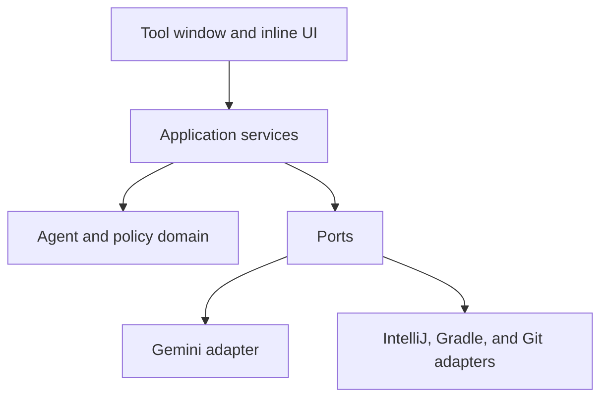

# Euhedral Gemini IntelliJ Plugin: Master Design Blueprint

Status: Approved for implementation

Date: 2026-08-08

Initial target: IntelliJ IDEA 2026.2

Plugin runtime: Java 25 and Kotlin

Initial repository support: Euhedral and Gradle

Agent model: `gemini-3.6-flash`

Inline completion model: `gemini-3.5-flash-lite`

## 1. Product idea

The plugin is a private, architecture-aware Gemini coding agent built directly into IntelliJ IDEA. It has two independent product surfaces:

1. An autonomous agent that can inspect a multi-module Java project, make reversible edits, run focused tests, repair failures, perform full verification, and present every action in an inspectable tool-window timeline.
2. A low-latency inline completion provider that uses bounded context around the caret and renders native multi-line ghost text.

The first target is Euhedral, whose core and adapter modules form a Ports and Adapters architecture. The plugin must understand module roles, Java language levels, framework boundaries, logging rules, and designated performance-sensitive paths. It must prevent architectural leaks such as Spring or Reactor imports entering a core module.

The agent is allowed to investigate, edit, build, and test autonomously inside the project. It is not allowed to commit, push, rewrite Git history, or run an unrestricted shell command without a separate human-controlled path. A task is not complete merely because the model says it is complete. The plugin owns the completion gate and requires successful targeted and repository-wide verification.

The user interface is an observer of engine events. It shows model activity, tool calls, validation failures, repair cycles, test output, changed files, diffs, approvals, cancellation, and rollback. It does not contain agent control logic.

## 2. Goals

- Make Gemini useful as a native IntelliJ coding agent without coupling the core engine to Swing, PSI, Git, Gradle, or Google's wire format.
- Mechanically enforce hard project invariants instead of relying only on prompt instructions.
- Preserve user work through durable edit transactions, conflict detection, native IDE commands, and deterministic rollback.
- Use IntelliJ indexes and project models for Java and cross-module understanding.
- Keep all long-running work off the event dispatch thread and make cancellation propagate through model, tool, and process work.
- Give the plugin, not the model, ownership of budgets, permissions, verification, and task completion.
- Keep the agent and inline completion implementations independent so latency work cannot destabilize autonomous execution.
- Start with a narrow Euhedral and Gradle implementation while retaining explicit ports for later Maven and additional-project support.
- Make every consequential action observable and testable without launching the full UI.

## 3. Non-goals for version 1

- Supporting IntelliJ releases other than 2026.2.
- Supporting Maven execution. A `BuildSystemPort` will exist, but only the Gradle adapter will be implemented.
- Supporting languages other than Java for architecture analysis and affected-test discovery.
- Giving Gemini direct access to `git commit`, `git push`, `git reset`, `git checkout`, `git clean`, or staging operations.
- Treating Git stashes as checkpoints or rollback storage.
- Providing an unrestricted terminal tool by default.
- Using a Google AI Pro or Ultra subscription as Gemini Developer API billing.
- Shipping OAuth before the API-key path is complete and reliable.
- Guaranteeing sub-100 ms remote completion latency.
- Uploading the repository to a Gemini File Search store or any other persistent retrieval service.
- Building a generic public marketplace plugin before the Euhedral workflow is stable.

## 4. Locked design decisions

### 4.1 Platform

- Target IntelliJ IDEA 2026.2 only.
- Compile and run the plugin on Java 25.
- Use Kotlin for plugin code and the IntelliJ Platform Gradle Plugin 2.x.
- Use the Kotlin coroutine library bundled with the IntelliJ Platform.
- Use a project-level service with an injected `CoroutineScope` as the owner of agent sessions and project-lifetime jobs.
- Use Kotlin UI DSL 2 for settings and standard Swing/IntelliJ components for the tool window.
- Keep the first implementation in one Gradle module with enforced package boundaries. Split Gradle modules only if packaging, classloader, or build-time pressure justifies it.

The plugin runtime JDK is independent from the JDK and Java language level of a project being analyzed. A Java 25 plugin can inspect Java 11, 17, or 21 modules.

### 4.2 Gemini API and models

- Use the Gemini Interactions API and its current `steps` response schema.
- Use `gemini-3.6-flash` for autonomous agent work.
- Use `gemini-3.5-flash-lite` for inline completion.
- Default agent thinking level to `medium` and allow a setting for `low`, `medium`, or `high`.
- Fix inline completion at `minimal` thinking unless measurements justify another level.
- Use `previous_interaction_id` and `store=true` by default for agent sessions.
- Re-send tools, system instructions, and generation configuration on every continued interaction because those values are interaction-scoped.
- Use stateless `store=false` requests for inline completion.
- Centralize model IDs and API schema handling so model replacement requires configuration changes rather than engine changes.

Stateful Interactions data is retained by Google according to the selected Gemini API tier and project retention configuration. Current defaults are one day on the free tier and 55 days on the paid tier, with shorter paid-tier retention configurable in AI Studio. The settings page must disclose this, expose the stateful toggle, and offer a best-effort delete action for stored sessions. The plugin tracks every interaction ID in a session chain so deletion can target every turn; deleting only the latest ID is not assumed to cascade. The default remains stateful as selected for this project.

### 4.3 Transport and credentials

- Define a `GeminiTransport` port and implement it with `java.net.http.HttpClient`.
- Use REST and Server-Sent Events directly rather than adding Ktor or a Node/Python sidecar.
- Use explicit serializable request and response DTOs around the current Interactions schema.
- Store API keys only in IntelliJ `PasswordSafe` using `CredentialAttributes`.
- Implement API-key authentication first.
- Add desktop OAuth as a later provider. OAuth still requires a Google Cloud project with the Generative Language API enabled; it does not convert a consumer Gemini subscription into Developer API billing.
- Never log credentials, authorization headers, full source payloads, or raw tool results by default.

### 4.4 Build scope

- Version 1 supports Gradle projects with a wrapper.
- Project discovery uses the IntelliJ project and linked Gradle model.
- Process execution uses the repository wrapper through `GeneralCommandLine` and `OSProcessHandler` without `bash -c`, `cmd /c`, or another shell interpreter.
- The plugin does not force `clean`, configuration-cache flags, build-cache flags, or daemon flags. It respects the repository's own Gradle configuration.
- A later Maven adapter implements the same `BuildSystemPort`; no Maven conditionals belong in the agent engine.

### 4.5 Git and commit behavior

- Model-visible Git operations are read-only.
- `request_commit(message)` is an engine control call, not a Git tool.
- After successful verification, this call displays the proposed message and opens IntelliJ's native Commit UI. The user selects files and performs the commit.
- Version 1 does not stage or commit automatically, even after approval.
- Push, reset, checkout, clean, rebase, and history rewriting are outside plugin scope.

This is stronger and simpler than parsing terminal commands for forbidden Git text.

## 5. Architectural shape

The plugin uses a package-enforced hexagonal architecture. Domain and application code know only ports and serializable values. IntelliJ, Gemini, Gradle, Git, credentials, and UI are adapters.



Recommended package layout:

```text
com.euhedral.gemini
+-- core
|   +-- agent
|   |   +-- AgentSession.kt
|   |   +-- AgentState.kt
|   |   +-- AgentEvent.kt
|   |   +-- AgentBudget.kt
|   |   +-- AgentReducer.kt
|   +-- tools
|   |   +-- ToolCall.kt
|   |   +-- ToolResult.kt
|   |   +-- ToolDescriptor.kt
|   |   +-- ToolEffect.kt
|   +-- policy
|       +-- PolicyDecision.kt
|       +-- ValidationFinding.kt
|
+-- application
|   +-- AgentExecutionEngine.kt
|   +-- AgentSessionService.kt
|   +-- ToolDispatcher.kt
|   +-- VerificationService.kt
|   +-- AffectedCodeAnalyzer.kt
|   +-- CompletionCoordinator.kt
|
+-- ports
|   +-- GeminiTransport.kt
|   +-- WorkspaceInspectionPort.kt
|   +-- WorkspaceEditPort.kt
|   +-- BuildSystemPort.kt
|   +-- GitReadPort.kt
|   +-- CredentialPort.kt
|   +-- CheckpointStore.kt
|   +-- ApprovalPort.kt
|
+-- adapters
|   +-- gemini
|   |   +-- GeminiHttpTransport.kt
|   |   +-- InteractionRequestMapper.kt
|   |   +-- InteractionStreamParser.kt
|   |   +-- GeminiToolSchemaMapper.kt
|   +-- intellij
|   |   +-- context
|   |   |   +-- ProjectContextService.kt
|   |   |   +-- ModuleClassifier.kt
|   |   |   +-- PsiContextExtractor.kt
|   |   |   +-- SymbolResolver.kt
|   |   +-- editing
|   |   |   +-- IntelliJWorkspaceEditor.kt
|   |   |   +-- EditTransaction.kt
|   |   |   +-- CheckpointService.kt
|   |   +-- process
|   |   |   +-- IntelliJProcessRunner.kt
|   |   +-- git
|   |       +-- IntelliJGitReader.kt
|   +-- gradle
|   |   +-- GradleBuildAdapter.kt
|   |   +-- GradleDiagnosticParser.kt
|   +-- credentials
|       +-- PasswordSafeCredentials.kt
|
+-- policy
|   +-- ProjectRulesService.kt
|   +-- PolicyEngine.kt
|   +-- WorkspaceBoundaryValidator.kt
|   +-- ForbiddenImportValidator.kt
|   +-- LanguageLevelValidator.kt
|   +-- LoggingValidator.kt
|   +-- SensitivePathValidator.kt
|
+-- completion
|   +-- GeminiInlineCompletionProvider.kt
|   +-- CompletionContextBuilder.kt
|   +-- CompletionCache.kt
|   +-- CompletionMetrics.kt
|
+-- ui
|   +-- AgentToolWindowFactory.kt
|   +-- AgentToolWindowViewModel.kt
|   +-- AgentActionTree.kt
|   +-- DiffViewerService.kt
|   +-- ApprovalPanel.kt
|
+-- settings
|   +-- GeminiSettings.kt
|   +-- GeminiSettingsConfigurable.kt
|
+-- bootstrap
    +-- GeminiProjectService.kt
    +-- ToolRegistryFactory.kt
```

Boundary rules:

- `core` imports neither IntelliJ APIs nor adapter classes.
- `application` depends on `core` and `ports`, never concrete adapters.
- `ports` contain interfaces and transport-neutral values only.
- `adapters` may depend on IntelliJ, Google wire DTOs, Gradle, or Git APIs.
- `ui` consumes immutable view state and `AgentEvent` streams. It does not call PSI, processes, or Gemini directly.
- `completion` does not call `AgentExecutionEngine` and does not reuse agent conversation state.
- Dependency rules are enforced with architecture tests.

## 6. Agent domain and execution protocol

### 6.1 State model

Use a small session state machine instead of encoding a fixed inspect, edit, test, and fix script.

```text
IDLE
  -> RUNNING
RUNNING
  -> WAITING_APPROVAL
  -> VERIFYING
  -> COMPLETED
  -> FAILED
  -> CANCELLED
WAITING_APPROVAL
  -> RUNNING
  -> CANCELLED
VERIFYING
  -> RUNNING
  -> COMPLETED
  -> FAILED
  -> CANCELLED
```

Model requests, tool batches, edits, tests, and repair attempts are events and operations inside `RUNNING`, not separate top-level states. This keeps the reducer small while preserving a detailed event timeline.

`AgentReducer` is pure. Given current state and an event, it returns the next state or rejects an invalid transition. Side effects are started by `AgentExecutionEngine` after a valid transition.

### 6.2 Session ownership

- Allow one mutating agent session per project.
- Read-only analysis sessions may be added later, but version 1 serializes all agent sessions.
- Inline completion runs independently and may overlap an agent session.
- The project service's injected coroutine scope owns the session job.
- Closing the project, unloading the plugin, or pressing Cancel cancels the scope branch and all model, tool, and process children.
- Each session has a stable local ID, the ordered remote interaction ID chain, transaction ID, project fingerprint, limits, counters, current revision digest, and terminal reason.

### 6.3 Interaction loop

The engine follows model-selected investigation while retaining control of effects:

```kotlin
while (!session.state.isTerminal) {
    val interaction = transport.interact(session.nextRequest())
    val calls = interaction.functionCalls()

    if (calls.isNotEmpty()) {
        val results = toolDispatcher.executeBatch(session, calls)
        session.continueWith(interaction.id, results)
    } else {
        session.acceptModelOutput(interaction)
    }
}
```

Production code must express this through explicit effects, events, cancellation, and error types rather than a single large loop method.

Rules for every interaction:

- Validate the interaction ID, step types, call IDs, tool names, and arguments before execution.
- Re-send tool declarations, system instructions, and generation configuration on every call.
- Preserve each function call ID in its corresponding `function_result`.
- Treat mutating calls as at-most-once operations. A duplicate call ID returns the prior result rather than executing twice.
- Do not require raw XML, YAML, or JSON status text before tool calls.
- Stream model text and step status into events, but do not treat streamed prose as authorization.
- A final model response before successful `complete_task` returns a control error explaining that verification is required.

### 6.4 Tool batch semantics

Every tool descriptor declares an effect:

```text
READ_ONLY
MUTATING
PROCESS
CONTROL
```

- A batch containing only independent `READ_ONLY` calls may run concurrently.
- Any batch containing `MUTATING`, `PROCESS`, or `CONTROL` calls runs in response order.
- `complete_task` must be the only control call in its batch.
- PSI/index reads use smart, cancellable read actions.
- Mutations are serialized through the active `EditTransaction`.
- Tool output is bounded and structured. Truncation is explicit and supplies a continuation mechanism where appropriate.

### 6.5 Independent limits

Defaults:

| Limit | Default | Consumed by |
|---|---:|---|
| HTTP retries | 3 | Transport failures, 429, and retryable 5xx responses |
| Transient tool retries | 2 | Indexing, temporary I/O, and process-start failures |
| Repair cycles | 5 | Failed mandatory verification after `complete_task` |
| Model turns | 40 | Each Interactions request |
| Tool calls | 100 | Every accepted model function call |
| Session duration | 30 minutes | Wall-clock session time |
| Single process timeout | 15 minutes | One Gradle invocation |
| Inline response timeout | 5 seconds | One completion request |

HTTP backoff uses server guidance when available, otherwise capped exponential backoff with jitter. A transport or indexing retry never consumes a repair cycle. A model-requested test failure during ordinary iteration also does not consume a repair cycle. Only a failed mandatory completion verification does.

## 7. Model-visible tool surface

The model sees dedicated tools with shallow, non-polymorphic schemas. `ToolExecutor` is an internal dispatcher, not a model-visible mega-tool.

### 7.1 Inspection tools

| Tool | Purpose |
|---|---|
| `workspace_context()` | Return project root, Gradle identity, configured modules, roles, SDKs, language levels, active file, and rule summary. |
| `read_file_range(path, start_line, end_line)` | Read a bounded line range with content hash and line metadata. |
| `search_text(query, path, file_glob)` | Search bounded project text. Optional filters are independent, not discriminator-controlled. |
| `find_symbol(name, kind, scope)` | Resolve Java symbols and return opaque session symbol IDs plus locations and signatures. |
| `find_references(symbol_id)` | Use IntelliJ reference search for a previously resolved symbol. |
| `find_implementations(symbol_id)` | Find class inheritors or overriding methods as appropriate. |
| `file_metadata(path)` | Return existence, type, size, encoding, module, source set, and current content hash. |

Search results contain project-relative paths and bounded snippets. Absolute paths are never sent to Gemini unless they are already inside explicitly approved user text.

### 7.2 Editing tools

| Tool | Purpose |
|---|---|
| `replace_text(path, old_text, new_text, expected_hash)` | Replace one exact occurrence against an expected file revision. |
| `create_file(path, content)` | Create a new project file and required project-local parent directories inside the active transaction. |
| `delete_file(path, expected_hash)` | Delete a file through a reversible transaction after policy approval. |
| `move_file(source, destination, expected_hash)` | Move one file through a reversible transaction. |

The first version deliberately omits arbitrary unified-diff application. Exact replacement produces clearer conflict behavior and simpler model errors. A later structured patch tool can be added only if measurements show a need.

An edit result includes the new hash, changed line range, validator findings, and transaction revision. Validation runs immediately after every mutation. A failed hard validator rejects and rolls back only that tool operation, not the entire session.

### 7.3 Build and test tools

| Tool | Purpose |
|---|---|
| `build_project()` | Run the configured Gradle compile/build task set and return structured diagnostics. |
| `test_module(module)` | Run the configured test task for one module. |
| `test_class(module, class_name)` | Run one Java test class through Gradle test filtering. |
| `test_method(module, class_name, method_name)` | Run one Java test method through Gradle test filtering. |

Process output streams to the UI while the tool suspends without blocking an IDE thread. The final result includes exit code, duration, bounded stdout/stderr, parsed compiler diagnostics, parsed test failures, and truncation metadata.

An internal process runner supports cancellation and termination. There is no need for a model-visible `kill_process` tool while all version 1 processes are foreground, bounded tool calls.

### 7.4 Git inspection tools

| Tool | Purpose |
|---|---|
| `git_status()` | Return repository and changed-file status without mutation. |
| `git_diff()` | Return a bounded working-tree diff. |
| `git_diff_file(path)` | Return a bounded working-tree diff for one required path. |
| `git_log(limit)` | Return bounded recent commit metadata. |
| `git_blame(path, line)` | Return blame information for one required path and line. |

Git reads should prefer stable IntelliJ Git integration where practical. A command fallback must still use argument arrays and remain read-only.

### 7.5 Engine control tools

| Tool | Purpose |
|---|---|
| `complete_task(summary)` | Ask the engine to run mandatory validation and verification. |
| `request_commit(message)` | Propose a commit message after verification and open the human-controlled commit flow. |

These are handled by the engine, not the general tool dispatcher.

### 7.6 Restricted command escape hatch

`run_command` is not enabled by default in version 1. The internal process port supports a future restricted command tool with these requirements:

- Explicit opt-in in settings and project rules.
- Human approval for each command unless an exact executable and argument pattern is allowlisted.
- Argument-array execution with no shell interpreter.
- Workspace working-directory enforcement.
- Environment-variable filtering and secret redaction.
- Process timeout, output cap, and cancellation.
- Denial of Git mutation commands even when the command tool is enabled.

## 8. Task completion and verification ownership

`complete_task` is the only route to a successfully completed agent session.

Protocol:

1. Gemini calls `complete_task(summary)` as the only function call in the turn.
2. The engine freezes the current transaction revision and enters `VERIFYING`.
3. All hard validators run against every changed file.
4. `AffectedCodeAnalyzer` creates a verification plan.
5. Directly affected test methods or classes run when confidence is high.
6. Affected module tests run when direct selection is incomplete or the blast radius is wider.
7. The configured repository-wide verification tasks run.
8. On failure, the engine returns structured diagnostics, increments the repair-cycle counter, and returns to `RUNNING`.
9. On success, the engine records the verified transaction digest and returns success to Gemini.
10. The next final model response marks the session `COMPLETED` only if the transaction digest still matches the verified digest.

If Gemini edits after successful verification, the verified digest is invalidated and `complete_task` must run again.

Verification escalation rules:

- A local method-body change may start with directly referencing tests.
- A public method signature change starts at module tests.
- An interface, build script, shared test fixture, native boundary, or module configuration change starts at module tests and always reaches full verification.
- A change with no confidently affected tests starts at module tests.
- Full verification never runs with `clean` unless project rules explicitly require it.

The model may invoke test tools while iterating. Those calls improve repair quality but do not replace the completion gate.

## 9. Durable editing and rollback

### 9.1 Why Git stashes are rejected

Automatic stashes mutate repository-wide state and interact poorly with staged changes, partial staging, untracked files, existing stashes, other Git clients, and parallel user activity. Git remains an inspection source, not the plugin's transaction manager.

### 9.2 Edit transaction

Every mutating session owns one `EditTransaction`. Before the first mutation of a path, the transaction records:

- Project-relative canonical path.
- Original existence state.
- Original in-memory document text when a document exists.
- Original bytes and encoding metadata when relevant.
- Original line-separator and byte-order-mark metadata.
- Original document modification stamp.
- Original content hash.
- Original writable state.
- The file's transaction lineage for create, delete, and move operations.

Each successful edit records:

- Tool call ID.
- Prior and resulting content hashes.
- Prior and resulting modification stamps.
- Changed ranges.
- Validator outcome.
- Timestamp and transaction revision.

### 9.3 Durable checkpoint journal

Checkpoints are persisted before mutation under the IntelliJ system directory, outside the repository and outside Git. The journal uses a manifest plus content-addressed blobs, restrictive local file permissions where supported, and atomic file replacement.

The journal enables recovery after an IDE or plugin crash. On reopening a project with an incomplete transaction, the plugin offers:

- Resume, only if every current hash matches the journal's expected revision.
- Roll back, only if agent-owned revisions have not been replaced externally.
- Inspect conflicts.
- Discard checkpoint metadata without modifying project files.

Checkpoint retention defaults to seven days and is configurable. Successful session cleanup must not occur until the user has had an opportunity to inspect or roll back the final diff.

### 9.4 IntelliJ write discipline

- Resolve and prepare edits off the event dispatch thread.
- Check `ReadonlyStatusHandler` before mutation.
- Apply document changes inside an IntelliJ command and suspending write action on the event dispatch thread.
- Keep write actions minimal.
- Use the session ID as the command group identity where supported.
- Save only transaction documents before an external build or test.
- Treat IntelliJ Undo as a convenience, not the recovery mechanism.

### 9.5 Conflict detection

Every mutating tool requires the content hash from the model's latest read. Immediately before applying an edit, the adapter compares the expected hash and modification stamp with the current document.

If content changed outside the transaction:

- Do not overwrite it.
- Emit `ExternalModificationDetected`.
- Enter `WAITING_APPROVAL`.
- Show the base, agent revision, and current user revision in a three-way conflict view when possible.
- Resume only after the user chooses a resolution or asks Gemini to re-read and adapt.

Rollback follows the same rule. It never overwrites a revision that is no longer known to be agent-owned.

## 10. Project intelligence

### 10.1 Context levels

Keep three different values explicit:

- IDE runtime JDK.
- Module SDK.
- Java source language level.

The context result for a Java file includes:

```json
{
  "module": "euhedral-core",
  "moduleRole": "CORE",
  "sourceSet": "MAIN",
  "sdk": "JDK 21",
  "languageLevel": "JAVA_21",
  "path": "euhedral-core/src/main/java/.../OrderService.java"
}
```

### 10.2 Module classification

Classification precedence:

1. Explicit `.euhedral-agent.yaml` module configuration.
2. Exact module path or name rules in configuration.
3. IntelliJ module and source-set model.
4. Framework classes available in main compile scope.
5. Main-source imports.
6. Heuristic fallback.

Test-only and transitive dependencies must not turn a core module into a framework adapter. A heuristic classification may guide the prompt but may not activate a hard forbidden-import validator. Hard architectural denial requires explicit configuration or another unambiguous repository rule.

Initial roles:

```text
CORE
SPRING_ADAPTER
REACTOR_ADAPTER
OTHER
```

### 10.3 Symbol resolution

Use native IntelliJ mechanisms:

- `JavaPsiFacade` and `PsiShortNamesCache` for symbol lookup.
- `ReferencesSearch` for usages.
- `ClassInheritorsSearch` for implementations.
- `OverridingMethodsSearch` for overrides.
- Smart PSI element pointers for session-local references.

The model receives an opaque symbol ID plus stable descriptive fields. It never receives a live PSI object. The adapter re-resolves or rejects an invalidated pointer inside each smart read action.

### 10.4 Indexing behavior

- Project-wide PSI work uses cancellable smart read actions.
- Dumb/indexing mode is a transient tool condition, not a code failure.
- The UI shows `Waiting for indexing` rather than a repair attempt.
- Cancellation while waiting for smart mode returns promptly.
- No external process is awaited while holding a PSI read lock.

### 10.5 Agent context construction

Agent context is demand-driven. The initial request contains:

- User request.
- Compact project rules summary.
- Active file and selection metadata when relevant.
- Tool declarations.
- Completion requirements and current budgets.

It does not eagerly include the repository or every module. Gemini uses inspection tools to retrieve only the code it needs.

## 11. Project rules and invariant enforcement

Euhedral-specific behavior belongs in `.euhedral-agent.yaml`, not in plugin source.

Example schema:

```yaml
schemaVersion: 1

project:
  buildSystem: gradle
  root: .

modules:
  euhedral-core:
    path: euhedral-core
    role: core
    java: 21
  euhedral-spring:
    path: adapters/euhedral-spring
    role: spring-adapter
    java: 21
  euhedral-reactor:
    path: adapters/euhedral-reactor
    role: reactor-adapter
    java: 21

architecture:
  roles:
    core:
      forbiddenImports:
        - org.springframework
        - reactor.core

logging:
  framework: slf4j
  forbidSystemOut: true

encoding:
  newFiles: UTF-8
  preserveExisting: true
  asciiOnly: false

performance:
  hotPaths:
    - euhedral-core/src/main/java/**
  forbidInHotPaths:
    - streams
    - boxed-primitives
    - iterator-allocation
    - temporary-collections

testing:
  compileTasks:
    - classes
  moduleTestTask: test
  fullVerificationTasks:
    - test
  processTimeoutSeconds: 900

security:
  protectedPaths:
    - .git/**
    - .gradle/**
    - '**/.env'
    - '**/*.pem'
    - '**/*credentials*'
  rawCommands: deny
```

The exact Euhedral module paths must be filled from the real repository during implementation. The sample is intentionally not treated as repository truth.

Rule loading behavior:

- Parse and validate against a versioned schema.
- Report all configuration errors with paths and line numbers.
- Do not start a mutating agent session when hard-rule configuration is invalid.
- Allow read-only analysis with a visible warning.
- Cache parsed rules and invalidate on file change.
- Preserve unknown future fields when possible, but reject an unsupported higher `schemaVersion`.

### 11.1 Hard constraints

Hard constraints are mechanically enforced:

- Workspace and canonical-path boundaries.
- Symlink escape prevention.
- Protected and sensitive paths.
- Forbidden imports in explicitly classified modules.
- Module source language level.
- Prohibited logging calls.
- Model-inaccessible Git mutation.
- Required human approval for restricted capabilities.
- Required verification before completion.

### 11.2 Engineering preferences

Preferences guide the model and produce warnings unless project rules promote them to hard errors:

- Preserve the concurrency strategy already used by the surrounding subsystem.
- Do not introduce blocking locks into designated hot paths without a correctness reason.
- Keep designated hot paths allocation-free where practical.
- Avoid streams, boxing, iterator allocation, and temporary collections in those paths.
- Prefer existing primitive-specialized buffers and patterns.
- Use `VarHandle` or spinning only where the existing algorithm and measurements justify it.

This prevents the model from applying low-level concurrency techniques to cold control-plane code merely because they appeared in a global prompt.

### 11.3 Three enforcement layers

1. Prompt guidance: concise project rules and local engineering context.
2. Tool and policy restrictions: limit paths, effects, commands, and Git operations before execution.
3. Post-edit validation: inspect changed content before tests.

Validators return stable codes, severity, path, range, explanation, and suggested recovery. Gemini receives concise findings such as:

```text
ARCH_FORBIDDEN_IMPORT
euhedral-core/src/main/java/.../Foo.java:8
Import reactor.core.publisher.Mono is forbidden in role CORE.
```

## 12. Policy and security model

### 12.1 Policy decisions

Every effectful call receives one decision:

```text
ALLOW
DENY
REQUIRE_APPROVAL
```

The decision includes a stable reason code. `ToolDispatcher` cannot bypass it.

Default policy:

- Read ordinary project source: allow.
- Read protected or secret-like paths: deny.
- Edit ordinary source inside the project: allow within the active transaction.
- Delete or move a non-generated source file: require approval.
- Modify project rules: require approval.
- Execute declared Gradle build/test tasks: allow.
- Execute arbitrary command: deny.
- Git inspection: allow.
- Git mutation: unavailable.
- Access outside the canonical project root: deny.

### 12.2 Path safety

Before every file operation:

- Normalize the project-relative path.
- Reject absolute paths from model arguments.
- Resolve existing parents and symlinks.
- Verify the final canonical location remains inside an allowed content root.
- Reject `.git`, Gradle caches, IDE system data, credential patterns, devices, pipes, and special files.
- Re-check after parent creation to prevent time-of-check/time-of-use escapes.

### 12.3 Process safety

- Build `GeneralCommandLine` from an executable and argument list.
- Never interpolate model text into a shell string.
- Use the repository wrapper selected by operating system.
- Set the working directory to the linked Gradle root.
- Inherit only required environment values. Never return environment contents to Gemini.
- Redact credential-like output before logging or model submission.
- Bound output retained in memory and sent to the model.
- Terminate the process tree on cancellation or timeout.
- Emit output events without updating Swing components from background threads.

### 12.4 Prompt and data handling

- Show the user when source content will be sent to Gemini.
- Keep inline completion cache in memory only.
- Store only minimal local session metadata needed for recovery.
- Do not persist full prompts, full source payloads, or tool output unless an explicit diagnostic export is requested.
- Make remote interaction deletion available from session history.
- Clearly label stateful and stateless modes.

## 13. Gradle, diagnostics, and affected tests

### 13.1 Gradle adapter

`GradleBuildAdapter` implements `BuildSystemPort` and owns all Gradle-specific behavior:

- Discover linked Gradle roots and wrapper scripts.
- Map IntelliJ modules to Gradle project paths.
- Resolve the configured Gradle JVM without confusing it with source language level.
- Construct task arguments without a shell.
- Stream plain console output.
- Parse compilation and test diagnostics.
- Respect cancellation and timeouts.
- Return transport-neutral build results.

The agent engine never constructs `./gradlew` commands.

### 13.2 Affected-code analysis

Inputs:

- Changed files and ranges.
- Changed Java classes, methods, constructors, and interfaces.
- Signature versus body changes.
- Reference and inheritor search results.
- Module dependency direction.
- Project test configuration.

Outputs:

- Direct test methods with confidence.
- Direct test classes with confidence.
- Required module test tasks.
- Reasons for escalation.
- Full-verification task set.

Prefer false positives over false negatives for mandatory verification. If analysis is uncertain, escalate to module tests.

### 13.3 Structured diagnostics

Return a common shape:

```json
{
  "category": "COMPILATION",
  "path": "euhedral-core/src/main/java/.../Foo.java",
  "line": 42,
  "column": 17,
  "message": "cannot find symbol",
  "tool": "gradle",
  "task": ":euhedral-core:compileJava"
}
```

Test failures also include class, method, assertion summary, relevant stack frames, and the report path. Raw logs remain available to the UI but are bounded before submission to Gemini.

## 14. Gemini transport design

### 14.1 Port

```kotlin
interface GeminiTransport {
    suspend fun interact(request: InteractionRequest): InteractionResponse
    fun stream(request: InteractionRequest): Flow<InteractionStreamEvent>
    suspend fun deleteInteraction(interactionId: String): DeleteResult
}
```

The port uses plugin-owned DTOs, not Google JSON classes.

### 14.2 HTTP adapter

- Use one reusable `HttpClient`.
- Use asynchronous requests bridged into cancellable coroutines.
- Parse current SSE event types including `interaction.created`, `interaction.in_progress`, `interaction.requires_action`, `step.start`, `step.delta`, `step.stop`, and `interaction.completed`.
- Parse response `steps`, including model output, thought metadata when exposed, function calls, and errors.
- Treat unknown step and event types as forward-compatible values and log only safe metadata.
- Preserve call IDs exactly.
- Apply HTTP timeout, retry, `Retry-After`, and cancellation policy in the adapter.
- Keep API version, base URI, and optional revision header in one configuration object.
- Cover the wire contract with recorded sanitized fixtures and a local fake HTTP/SSE server.

### 14.3 Agent request configuration

Default:

```text
model: gemini-3.6-flash
store: true
thinking_level: medium
tool_choice: validated when supported, otherwise auto
temperature: low and measured
```

The system instruction should define role, hard boundaries, tool use, the `complete_task` requirement, conflict behavior, and concise progress reporting. Detailed repository truth comes from project rules and tools, not a massive static prompt.

### 14.4 Model lifecycle

Model names are settings with tested defaults. Startup performs a lightweight compatibility check and reports a clear configuration error if a model is unavailable. No fallback model is selected silently because model changes can alter coding and tool behavior.

## 15. Inline completion

Inline completion is a separate vertical slice with a separate request builder, cache, metrics, and cancellation policy.

### 15.1 IntelliJ integration

- Register the public `com.intellij.inline.completion.provider` extension point.
- Let IntelliJ own Tab acceptance, indentation, editor state, and keymap integration.
- Do not install a global Tab listener.
- Produce native multi-line inline completion elements.
- Allow only one active request per editor.

### 15.2 Request lifecycle

```text
Keystroke
  -> debounce
  -> cancel prior editor request
  -> capture bounded context
  -> memory-cache lookup
  -> stateless Gemini request
  -> stream or receive candidate
  -> reject stale document revision
  -> render native ghost text
```

Defaults:

- Debounce: 150 ms, adjustable after measurement.
- Prefix window: 8 KiB.
- Suffix window: 4 KiB.
- Max generated insertion: 1,024 tokens.
- Request timeout: 5 seconds.
- Thinking level: minimal.
- Cache: per-project in-memory LRU, 128 entries, 30-second TTL.

Context includes:

- Package and imports.
- Containing class declaration.
- Containing method or initializer.
- Prefix and suffix windows around the caret.
- Current selection when relevant.
- Module role and Java language level.
- A compact subset of completion-relevant project rules.

Do not include repository-wide context. If the entire current file is smaller than the bounded semantic context, including it is acceptable.

Cache keys include model ID, context hash, path, document revision, caret offset, and applicable rule version. The cache never persists source content to disk.

### 15.3 Latency objectives

- Context extraction and dispatch overhead: less than 10 ms at p95 on representative Euhedral files.
- Cancellation after a new keystroke: immediate from the provider's perspective.
- First visible remote suggestion: measured and reported, not guaranteed.
- Never display a completion generated for a stale document revision.

Local metrics record durations and outcome categories without source code or prompt content.

## 16. User interface and event model

### 16.1 Events

Representative events:

```kotlin
sealed interface AgentEvent {
    data class SessionStarted(...)
    data class ModelRequestStarted(...)
    data class ModelOutputDelta(...)
    data class ToolStarted(...)
    data class ToolCompleted(...)
    data class FileChanged(...)
    data class ValidationFailed(...)
    data class ProcessOutput(...)
    data class VerificationStarted(...)
    data class VerificationFailed(...)
    data class RepairStarted(...)
    data class ApprovalRequested(...)
    data class ExternalModificationDetected(...)
    data class SessionCompleted(...)
    data class SessionFailed(...)
    data class SessionCancelled(...)
}
```

`AgentToolWindowViewModel` reduces events into immutable UI state. Swing components observe that state on the event dispatch thread.

### 16.2 Tool window

The tool window contains:

- Chat transcript and current task input.
- Expandable action tree.
- Streamed model output.
- Tool arguments summarized without secrets.
- Live process output and structured diagnostics.
- Changed-file list.
- Native diff links comparing checkpoint and current content.
- Approval cards with exact action and risk.
- Cancel, Review Diff, Roll Back, Resume, and Open Commit UI controls.
- Current budgets and repair count.

Example statuses:

```text
[done] Read OrderService.java
[done] Find implementations of OrderPort
[done] Edit OrderService.java
[fail] OrderServiceTest failed
[done] Repair cycle 1
[run ] Full repository verification
```

### 16.3 Diff behavior

`DiffViewerService` builds requests from checkpoint content and current document content, then invokes IntelliJ `DiffManager`. File links contain project-relative paths and ranges. UI code does not compute diffs or read files directly.

### 16.4 Settings

Settings under `Tools -> Euhedral Gemini Agent` include:

- API-key status, set, replace, and remove.
- Agent and inline model IDs.
- Agent thinking level.
- Stateful agent interactions toggle, default on.
- Retention disclosure and remote-session delete action.
- Repair, turn, tool-call, process, and session limits.
- Inline enablement, debounce, context windows, timeout, and cache size.
- Project rules path and validation status.
- Restricted-command setting, default off.
- Checkpoint retention.
- Local diagnostic logging level.

Secrets are never part of `PersistentStateComponent` settings.

## 17. Threading and cancellation contract

| Work | Execution context |
|---|---|
| UI rendering and state application | EDT |
| PSI/index reads | Cancellable smart read actions on background execution |
| Document and PSI writes | Minimal command plus suspending write action on EDT |
| Gemini HTTP and SSE | Asynchronous HTTP bridged to project coroutine scope |
| Gradle processes | Background coroutine plus `OSProcessHandler` |
| Checkpoint disk I/O | `Dispatchers.IO` |
| Pure reducers, policy, parsing, and affected analysis | `Dispatchers.Default` |

Rules:

- Never block the EDT on a future, process, network request, lock, or index query.
- Never wait for a process while holding a PSI read action.
- Keep PSI values inside their read action or convert them to immutable DTOs and smart pointers.
- Check cancellation in long traversals and parsers.
- Propagate session cancellation to HTTP requests and the full process tree.
- Reject late events from a cancelled or superseded session.

## 18. Persistence and recovery

Persist only what is necessary:

- Application settings through a non-secret `PersistentStateComponent`.
- Project-local, non-roaming session metadata such as local session ID, ordered remote interaction IDs, status, transaction ID, and timestamps.
- Durable checkpoint journal in the IntelliJ system directory.
- Credentials in `PasswordSafe`.

Do not persist full model payloads or source-bearing event logs by default.

On IDE restart:

1. Load incomplete session metadata.
2. Locate its transaction journal.
3. Recompute the project fingerprint and changed-file hashes.
4. Offer Resume only when the state is consistent.
5. Offer Roll Back when current revisions are still agent-owned.
6. Otherwise open conflict inspection without writing.

## 19. Testing strategy

### 19.1 Pure unit tests

- State transitions and invalid transitions.
- Budget accounting and retry separation.
- Function-call de-duplication.
- Tool effect batching.
- Completion-gate digest behavior.
- Policy decisions and rule precedence.
- Rule schema validation.
- Diagnostic parsing.
- SSE parsing, including unknown events and split UTF-8 byte sequences.
- Affected-test escalation.

### 19.2 IntelliJ fixture tests

- Module SDK and language-level extraction.
- Main versus test dependency classification.
- Symbol, reference, inheritor, and override search across modules.
- Smart-mode waiting and cancellation.
- Document edits in commands/write actions.
- Read-only-file handling.
- Undo behavior.
- Symlink and canonical-path escape rejection.
- External-edit conflict detection.
- Native diff request construction.

### 19.3 Integration tests

- Fake Gemini HTTP server for normal, streaming, malformed, rate-limited, timed-out, and cancelled interactions.
- Function calls followed by function results using `previous_interaction_id`.
- Repeated mutating call IDs execute once.
- Temporary Gradle multi-project fixtures for compile and test selection.
- Gradle cancellation and process-tree termination.
- Checkpoint recovery after simulated interruption.
- Multi-file create, edit, move, delete, and rollback.
- Verification failure, repair, success, and post-verification mutation.

### 19.4 Platform verification

- Run plugin unit and integration tests.
- Run IntelliJ `runIde` smoke tests.
- Run Plugin Verifier against the selected IntelliJ IDEA 2026.2 build.
- Run IDE inspections for internal, experimental, obsolete, and scheduled-for-removal APIs.
- Fail the build on accidental Java target drift from 25.
- Validate `plugin.xml` and extension registration.

## 20. Failure matrix

| Failure | Required behavior |
|---|---|
| 429 or retryable 5xx | Respect `Retry-After`, consume HTTP retry only, show waiting state. |
| Malformed Gemini tool call | Return schema error to Gemini; do not execute. |
| Unknown Gemini step | Preserve safe metadata, ignore only if non-critical, fail clearly if required for correctness. |
| Indexing starts during PSI work | Cancel/restart in smart mode; consume transient tool retry only when appropriate. |
| User edits a target file | Stop mutation and enter conflict approval. |
| Project closes | Cancel model, tools, and processes; preserve transaction journal. |
| Plugin unloads | Same as project close. |
| Gradle hangs | Terminate process tree at timeout and return structured timeout. |
| Build or test fails during iteration | Return diagnostics; do not consume repair cycle. |
| Mandatory verification fails | Increment repair cycle and continue unless exhausted. |
| Repair budget exhausted | Mark failed, preserve diff and rollback controls. |
| API key missing or rejected | Stop before session mutation and open credential settings. |
| Stateful interaction expires | Explain loss of remote context; allow a new session with a locally generated compact handoff only after user confirmation. |
| Rollback sees an unknown current hash | Do not overwrite; open conflict inspection. |
| Checkpoint write fails | Abort the pending mutation. No edit occurs without a durable checkpoint. |
| Full verification succeeds, then file changes | Invalidate verified digest and require verification again. |

## 21. Observability

Record local, source-free metrics:

- Model request duration, retry count, status category, and token usage when provided.
- Tool duration, effect, result category, and output truncation.
- PSI wait and execution duration.
- Build/test duration and task identity.
- Repair-cycle count.
- Inline context-build, dispatch, first-result, cancellation, cache-hit, and stale-result durations.

Do not record prompts, source, diffs, credentials, command environment, or raw model output in normal telemetry. Version 1 should have no external telemetry endpoint.

## 22. Implementation phase index

The implementation is split into phase-local mini blueprints. Each mini blueprint is a fresh-context handoff containing its own locked contracts, deliverables, exclusions, tests, completion gate, and paired reasoning/coding prompts.

Use them in order. Do not load later mini blueprints merely because context remains available.

| Phase | Mini blueprint | Fresh-context input | Exit |
|---:|---|---|---|
| 0 | [Platform Skeleton](phases/phase-0-platform-skeleton.md) | Repository plus current IntelliJ 2026.2 documentation | Plugin loads, unloads, and verifies |
| 1 | [Domain and Ports](phases/phase-1-domain-ports.md) | Phase 0 plan and current source | Pure contracts pass without adapters |
| 2 | [Project Rules and Intelligence](phases/phase-2-project-intelligence.md) | Phase 1 contracts and current source | Inspection tools work without Gemini |
| 3 | [Durable Editing](phases/phase-3-durable-editing.md) | Phase 1-2 contracts and plans | Multi-file rollback is deterministic |
| 4 | [Policy and Validators](phases/phase-4-policy-validators.md) | Rules and editing contracts | Invalid effects fail before execution |
| 5 | [Gradle and Verification](phases/phase-5-gradle-verification.md) | Build port, project model, transaction, and policy contracts | Manual transactions can be fully verified |
| 6 | [Gemini Transport](phases/phase-6-gemini-transport.md) | Gemini and credential ports plus current official API documentation | Scripted tool exchanges pass |
| 7 | [Autonomous Agent](phases/phase-7-autonomous-agent.md) | Phase 1-6 plans and implementations | Headless edit-repair-verify flow passes |
| 8 | [Agent UI](phases/phase-8-agent-ui.md) | Agent events and application use cases | Full workflow is usable without logs |
| 9 | [Inline Completion](phases/phase-9-inline-completion.md) | Current plugin plus current inline/model documentation | Native completion is responsive and stale-safe |
| 10 | [OAuth](phases/phase-10-oauth.md) | Phase 6 credential/transport contracts plus current OAuth documentation | Both credential modes pass one contract |
| 11 | [Hardening and Release](phases/phase-11-hardening-release.md) | All phase plans, source, tests, and reports | Verified private artifact is reproducible |

Dependency sequence:

```text
0 Platform
  -> 1 Domain and ports
  -> 2 Project intelligence
  -> 3 Durable editing
  -> 4 Policy
  -> 5 Gradle and verification
  -> 6 Gemini transport
  -> 7 Autonomous agent
  -> 8 Agent UI
  -> 9 Inline completion
  -> 10 OAuth
  -> 11 Hardening and release
```

## 23. Master acceptance criteria

### Architecture and platform

- Plugin targets IntelliJ IDEA 2026.2 and Java 25.
- Architecture tests prevent core/application dependencies on IntelliJ, Gemini, Gradle, Git, or UI adapters.
- Project service scope cancels cleanly on project close and plugin unload.

### Agent behavior

- Gemini can inspect, edit, build, test, repair, and verify a Euhedral Gradle workspace.
- The engine does not encode a fixed inspect/edit/test sequence.
- A final response cannot complete a task before successful `complete_task` verification.
- HTTP, transient tool, and repair retry counters are independent.
- Tool and time budgets stop runaway sessions predictably.

### Project rules

- Core modules reject configured Spring and Reactor imports.
- Java syntax is validated against module language level, not plugin JDK.
- `System.out` and configured raw print calls are rejected.
- Performance rules apply only to designated hot paths and distinguish warnings from hard errors.

### Safety

- No Git stash is created.
- No model-visible Git mutation tool exists.
- No unrestricted command tool is enabled by default.
- No mutation occurs until its durable checkpoint is written.
- Rollback never overwrites unknown external changes.
- Symlink and canonical-path escapes are rejected.
- API keys exist only in `PasswordSafe`.

### Verification

- Direct tests run when confidently identified.
- Module tests run when blast radius or uncertainty requires them.
- Full configured verification runs before completion.
- A post-verification edit invalidates completion status.

### UI and completion

- The action tree is derived only from engine events.
- Changed-file links open native diffs.
- Commit requests open a human-controlled native Commit UI.
- Inline completion uses the native provider and respects custom keymaps.
- A new keystroke cancels the previous editor request.
- Stale completions are never rendered.
- Plugin context overhead meets the measured p95 target without claiming remote sub-100 ms latency.

## 24. Using the mini blueprints

Each phase file contains two prompts:

- Prompt A plans only that phase and writes an implementation plan under `docs/implementation/`.
- Prompt B reads the mini blueprint and approved implementation plan, implements only that phase, runs its checks, records evidence, and creates the phase commit.

The prompts intentionally do not require this entire master document. The mini blueprint restates the global rules that constrain its work and names the exact earlier plans or contracts it may read. The master remains the authority for product scope and cross-cutting acceptance criteria.

Execution rules:

- Run phases in numerical order.
- Start each prompt with a fresh context when practical.
- Give the prompt only its mini blueprint, the named prerequisite plans, repository instructions, and current source.
- Do not combine planning and implementation prompts.
- Do not combine phases.
- Treat each verified fast-forward commit on `main` as a context checkpoint.
- Stop on remote divergence or a material design ambiguity.
- If implementation discovers a cross-phase contract conflict, update the master and affected mini blueprints in a dedicated reviewed design commit before continuing.

## 25. Official references

- Gemini Interactions API: https://ai.google.dev/gemini-api/docs/interactions-overview
- Gemini function calling: https://ai.google.dev/gemini-api/docs/function-calling
- Gemini thinking levels: https://ai.google.dev/gemini-api/docs/thinking
- Gemini models: https://ai.google.dev/gemini-api/docs/models
- Gemini deprecations: https://ai.google.dev/gemini-api/docs/deprecations
- Gemini OAuth: https://ai.google.dev/gemini-api/docs/oauth
- Gemini API billing: https://ai.google.dev/gemini-api/docs/billing
- IntelliJ 2026 API changes and Java requirements: https://plugins.jetbrains.com/docs/intellij/api-changes-list-2026.html
- IntelliJ build number and runtime compatibility: https://plugins.jetbrains.com/docs/intellij/build-number-ranges.html
- IntelliJ threading model: https://plugins.jetbrains.com/docs/intellij/threading-model.html
- IntelliJ coroutine scopes: https://plugins.jetbrains.com/docs/intellij/coroutine-scopes.html
- IntelliJ services: https://plugins.jetbrains.com/docs/intellij/plugin-services.html
- IntelliJ documents and commands: https://plugins.jetbrains.com/docs/intellij/documents.html
- IntelliJ PSI cookbook: https://plugins.jetbrains.com/docs/intellij/psi-cookbook.html
- IntelliJ process execution: https://plugins.jetbrains.com/docs/intellij/execution.html
- IntelliJ sensitive data storage: https://plugins.jetbrains.com/docs/intellij/persisting-sensitive-data.html
- IntelliJ extension point list: https://plugins.jetbrains.com/docs/intellij/intellij-platform-extension-point-list.html
